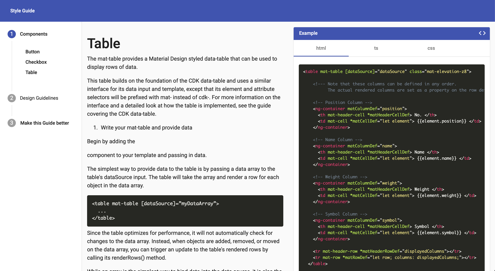

# Angular Style Guide
This is a simple style guide to use with Angular with a document viewer [ngx-markdown](https://www.npmjs.com/package/ngx-markdown)
It can read html, typescript, css, markdown and many more.
<br/>
<p align="center">
<br/><br/>
  

</p>
<br/>


## Installation
```javascript
$> npm install
$> ng serve
```
Go to http:/localhost:4200

## Add New Design Guideline

- Your new design guideline will be a component included in the design files.  
- Add your new Component in [src/app/design](./src/app/design)  
- Declare it in app.router.ts and app.module.ts  
- Re-build, Re-run.  

## Add New Component

- Add your new Component in [src/app/components](./src/app/doc-viewer/components)
- You can add a README.md explaining how to install and use your component.
- Declare it in [src/app/doc-viewer/doc-viewer-routing.module.ts](./src/app/doc-viewer/doc-viewer-routing.module.ts) and [src/app/sharedshared.module.ts](./src/app/sharedshared.module.ts) following the existing components way. Be carefull between imports/exports/declarations.
- Add your files path in [src/app/service/component/components.service.ts](./src/app/service/component/components.service.ts)
- Re-build, Re-run.

